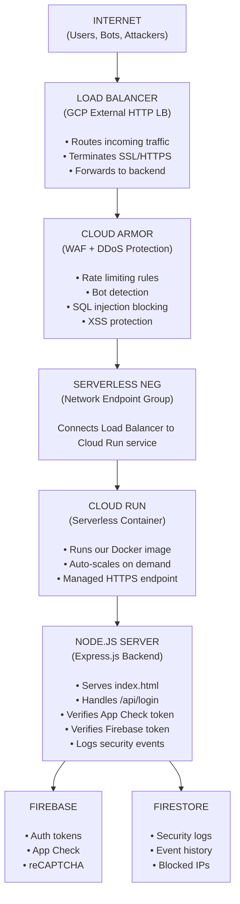

# SafeAPI Architecture

## Overview

SafeAPI is built using a **serverless, cloud-native architecture** on Google Cloud Platform. This document explains every component, why it was chosen, and how they all connect.

---

## System Architecture Diagram

---

## Request Flow — What Happens When You Log In

### Step 1: Browser loads the page
- User opens `https://safeapi-452254762534.us-central1.run.app`
- Request goes through Load Balancer → Cloud Armor → Cloud Run
- Node.js server serves `index.html`

### Step 2: reCAPTCHA runs in background
- As soon as the page loads, reCAPTCHA Enterprise silently analyzes the browser
- It checks: Is this a real browser? Is this a bot? What's the risk score?
- reCAPTCHA generates an **attestation** proving this is a legitimate browser environment

### Step 3: App Check token is generated
- Firebase App Check uses the reCAPTCHA attestation
- It generates a signed **App Check JWT token**
- This token proves: "This request came from the real SafeAPI web app"
- Token is stored in the browser and auto-refreshed

### Step 4: User clicks Sign In
- Browser sends POST request to `/api/login`
- Request includes:
  - `X-Firebase-AppCheck` header (the App Check token)
  - JSON body with Firebase ID token

### Step 5: Server verifies App Check token
- Node.js server receives the request
- Checks `X-Firebase-AppCheck` header
- Verifies token using Firebase Admin SDK
- If invalid → returns **401 Unauthorized**
- If valid → proceeds to next step

### Step 6: Server verifies user identity
- Server verifies the Firebase ID token
- Decodes it to get user's email and UID
- If invalid → returns **401 Unauthorized**
- If valid → login succeeds

### Step 7: Security event is logged
- Server saves a `LOGIN_SUCCESS` event to Firestore
- Records: email, IP address, user agent, timestamp, app ID

---

## Two Services Architecture

The project is split into two separate services:

### Service 1: UI (Cloud Run)
- Serves the HTML login page
- Generates App Check tokens
- Calls the backend API
- Handles user interaction

### Service 2: Backend (Node.js on Cloud Run)
- Receives login requests
- Verifies App Check tokens
- Verifies Firebase ID tokens
- Logs security events to Firestore

**Why two services?**
- Separation of concerns — frontend and backend are independent
- Each can scale independently
- Backend can be secured separately from the UI
- Follows real-world microservices architecture

---

## Component Details

### Google Cloud Run
Cloud Run is a **serverless container platform**. You give it a Docker image, and it:
- Runs it automatically
- Scales up when traffic increases
- Scales down to zero when no traffic (saves money)
- Provides a managed HTTPS URL
- No server management needed

### Load Balancer
The Load Balancer sits in front of Cloud Run and:
- Accepts all incoming internet traffic
- Routes requests to the correct backend
- Handles SSL certificate termination
- Enables Cloud Armor to be attached

### Serverless NEG (Network Endpoint Group)
Since Cloud Run is serverless (no fixed IP addresses), a special connector called a **Serverless NEG** is needed to connect the Load Balancer to Cloud Run. It acts as a bridge between the two.

### Artifact Registry
When you deploy to Cloud Run, your Docker image is stored in **Artifact Registry**. Think of it as a private container image library. Every deployment creates a new version stored here.

### Firestore
Firestore is Google's **NoSQL real-time database**. We use it to store security events. Every login attempt (successful or blocked) is saved as a document with a timestamp, IP address, and reason.

---

## Why This Architecture?

| Decision | Reason |
|----------|--------|
| Cloud Run over VMs | No server management, auto-scaling, pay-per-use |
| Docker | Consistent environment across local/cloud |
| Firebase Auth | Production-grade auth without building from scratch |
| App Check | Prevents API abuse from scripts and bots |
| Firestore | Real-time logging without managing a database server |
| Load Balancer | Required for Cloud Armor, custom domain, SSL |
| Node.js + Express | Lightweight, fast, JavaScript ecosystem |
