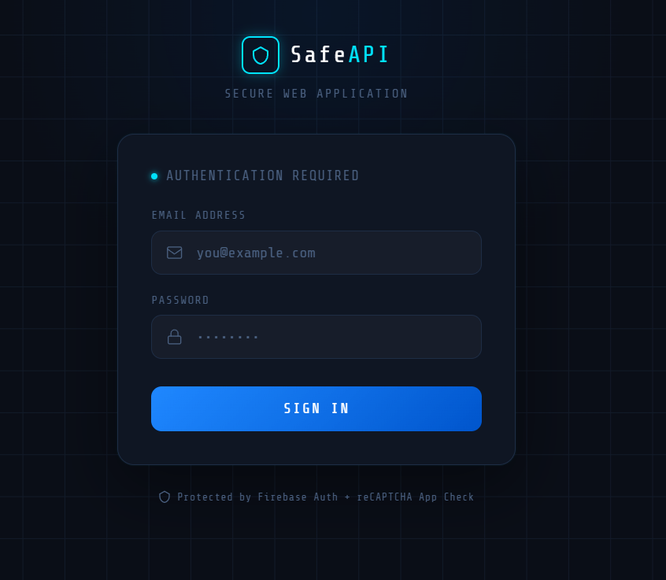
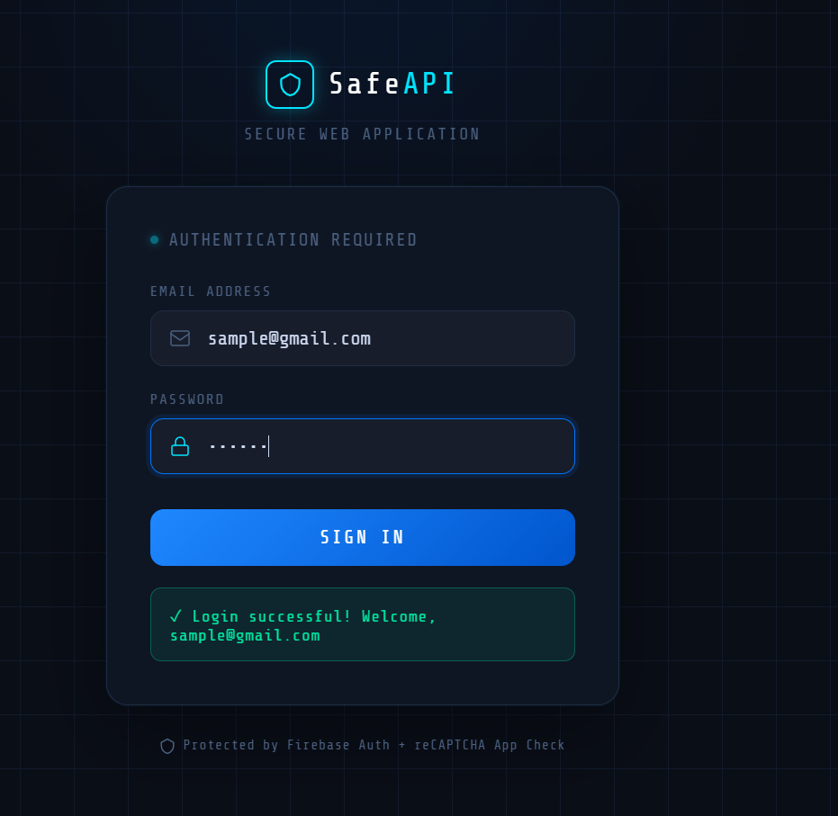
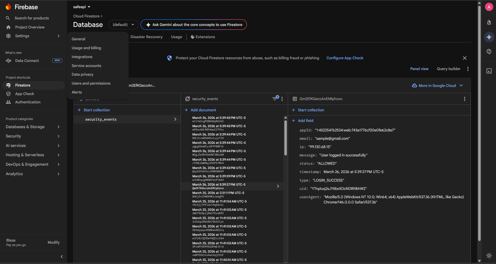
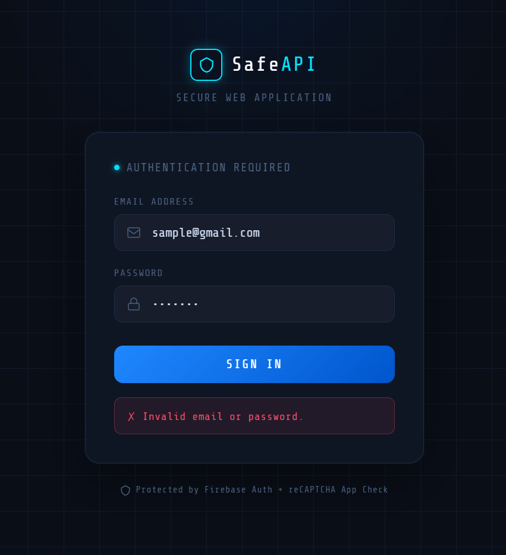
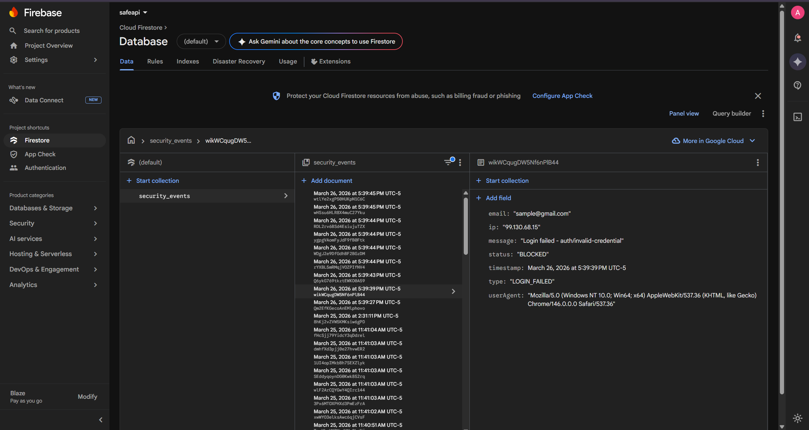
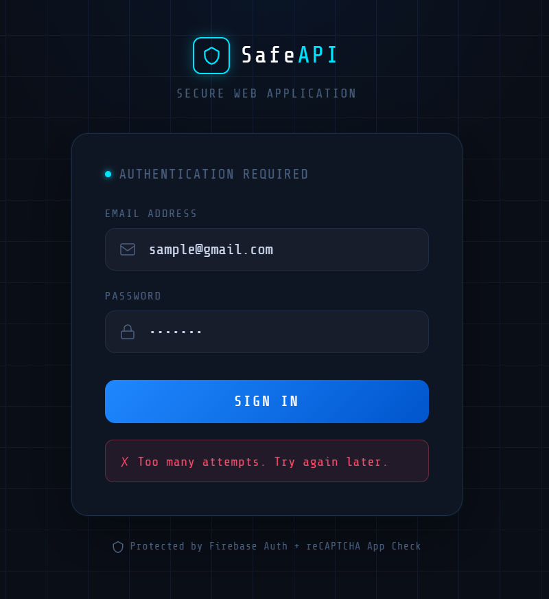
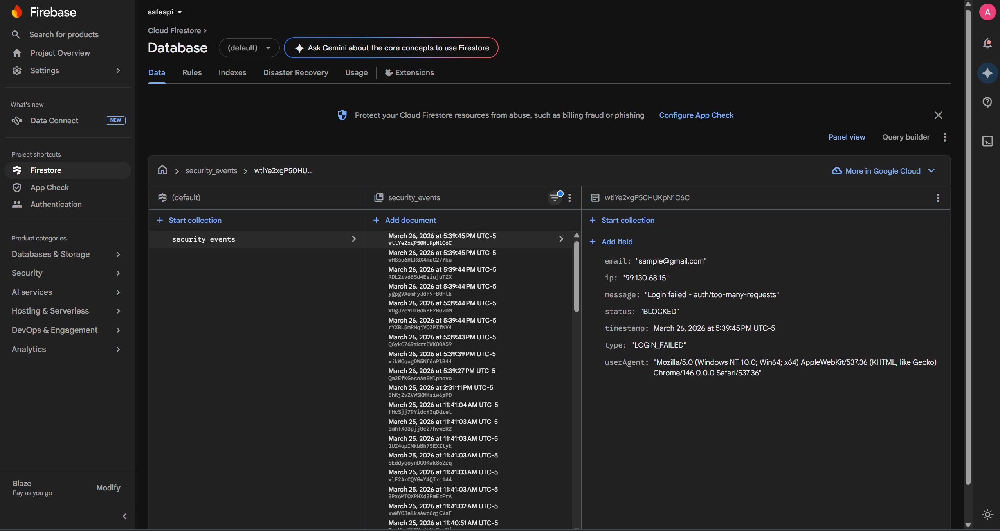

# SafeAPI - Secure Web Application

A secure web application built with multiple layers of cybersecurity protection, deployed on Google Cloud Platform.

---

## What is this?

SafeAPI is a secure login system that protects against real-world cyber threats including bot attacks, brute force attempts, DDoS attacks, and unauthorized API access.

---

## Tech Stack

Firebase Auth · App Check · reCAPTCHA Enterprise · Node.js · Express · Firestore · Docker · Google Cloud Run · Load Balancer · Cloud Armor

---

## Security Layers

1. **Firebase Authentication** — verifies user identity via JWT tokens
2. **App Check + reCAPTCHA Enterprise** — verifies requests come from the real app, not bots
3. **Rate Limiting + Bot Detection** — blocks brute force and automated attacks
4. **Cloud Armor** — network-level DDoS and WAF protection at the Load Balancer

---

## Documentation

| File | Contents |
|------|---------|
| [Architecture.md](Architecture.md) | System diagram, request flow, component details |
| [SECURITY.md](security.md) | Each security layer, attacks prevented, how it works |
| [DEPLOYMENT.md](deployment.md) | Full deployment guide with explanations |

---

## Output

### Login page:

### Valid credentials:

### Invalid credentials:

### Rate Limiting

